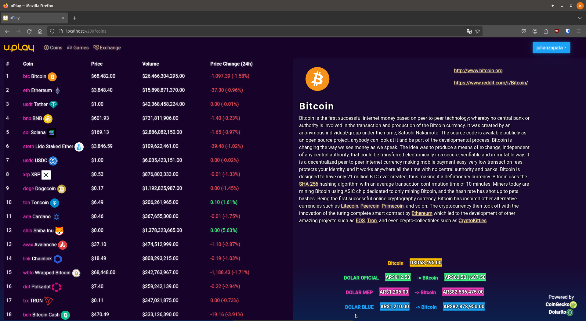
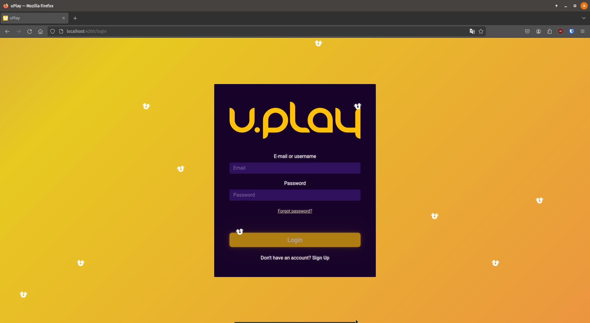
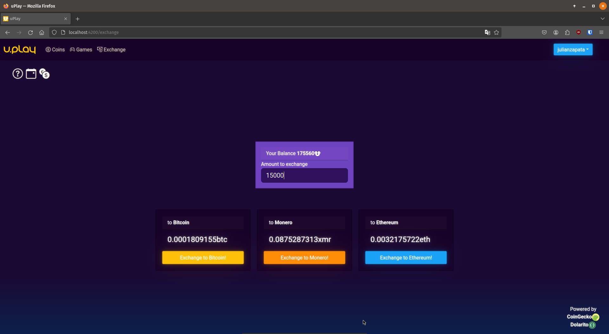

# uPlay

Trabajo final de la materia Laboratorio de Computación IV de la carrera Tecnicatura Universitaria en Programación.  

  Este proyecto tiene como misión desarrollar una aplicación utilizando el framework Angular, esta le debe brindar a los usuarios información sobre criptomonedas, integrando una API REST. Además, debe proporcionar a los usuarios registrados un espacio donde puedan explorar y utilizar funciones relacionadas con criptomonedas para ampliar su experiencia.

## APIs utilizadas:
  CoinGecko: https://www.coingecko.com/
  Dolarito: https://www.dolarito.ar/

## Frontend:
https://github.com/julianZ99/uPlay

###  Angular:
La interfaz de usuario se construye utilizando Angular, un framework de desarrollo web de código abierto mantenido por Google. Angular permite la creación de SPAs y ofrece una estructura modular para organizar el código.
###  Bootstrap:
Se utiliza Bootstrap para la maquetación y diseño responsivo de la interfaz. Bootstrap proporciona componentes y estilos predefinidos que agilizan el desarrollo.
  
## Backend:
https://github.com/alanmedina1995/apiUplay

###  Spring Boot:
El backend de la aplicación se implementa con Spring Boot, un framework de desarrollo de aplicaciones Java que simplifica la creación de servicios RESTful. Spring Boot facilita la configuración, desarrollo y despliegue de aplicaciones Java.
###  H2 Database:
H2 es un sistema de gestión de bases de datos relacional en memoria que se utiliza para el almacenamiento de datos. Lo elegimos ya que es una opción ligera y conveniente para entornos de desarrollo y pruebas.

## Landing Page:

## Login:

## Exchange:

